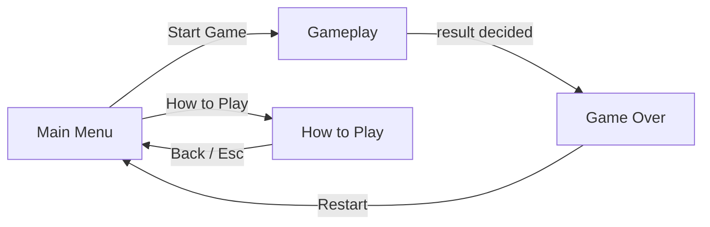
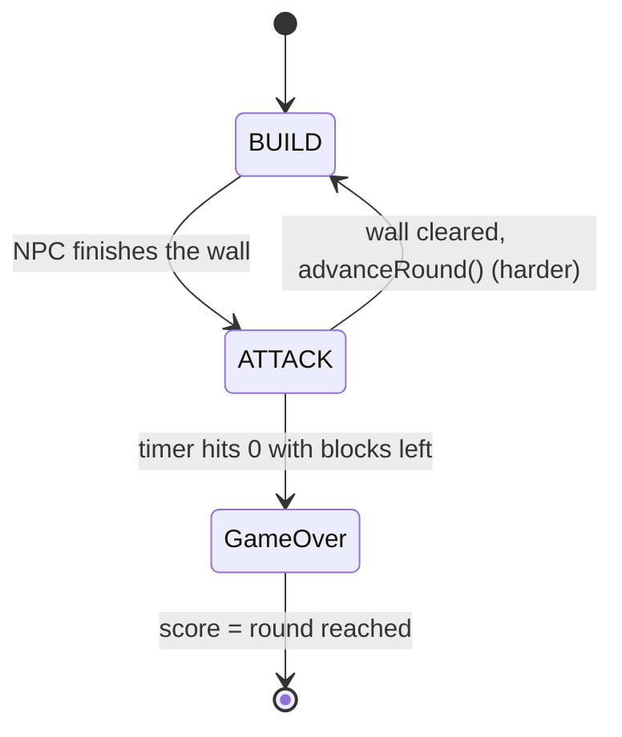
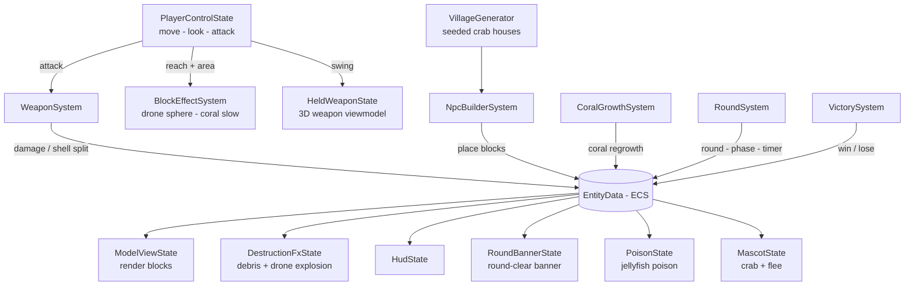

# ourbreak

A first-person **beach-siege endless survival** game. You play Openclaw the destroyer:
each round an NPC builds up a fortified **crab village** around its mascot, and you have a
limited time to tear every building down before the clock runs out. Survive to advance —
the village gets bigger and the pressure rises every round. Your score is how far you get.

Built with **Java 21 + jMonkeyEngine 3.9 + Zay-ES (ECS) + Lemur (UI)**. MIT licensed.

## Gameplay

📹 **[Gameplay videos (Google Drive)](https://drive.google.com/drive/folders/1PX8SBM3ZS3v7FYbvHv5lShIvldhKZ7L2?usp=sharing)**

## How to play

| Action | Input |
|--------|-------|
| Move | `W` `A` `S` `D` |
| Look | Mouse |
| Attack | Left click |
| Switch weapon | `1` Sword · `2` Gun · `3` Drone (`Q` cycles) |
| Confirm / Back | `Enter` / `Esc` |

- **Sword** is melee — get in close to sweep a row of blocks (the poison-free way to clear
  Jellyfish). **Gun** one-shots any single block at range (the clean answer to Coral and
  Jellyfish). **Drone** bombs a 3D blast sphere that grows each round (its **Lv** shows on
  the HUD) — but bombing a Jellyfish poisons you and bombing Shells makes them split.
- **Coral** regrows the village while alive (kill it with the Gun), **Rock** is tanky (use
  the Drone), **Shell** splits under Sword/Drone, **Jellyfish** poisons you if droned.

See the in-game **How to Play** screen for the full reference.

## How it works

Screens are jME `AppState`s; the game itself is a Zay-ES ECS (the systems read and write a
shared `EntityData`).



Each round is a BUILD → ATTACK loop; surviving advances to a harder round, a timeout loses:



Systems read/write the shared ECS each frame:



## Build & run

The toolchain is pinned with Nix flakes; enter the dev shell first:

```bash
nix develop          # or: direnv allow (once)
./gradlew run        # play
./gradlew test       # headless unit tests
./gradlew :app:distZip   # portable cross-platform build (build/distributions)
```

Runtime is Java 21. The `distZip` bundles every platform's natives, so a build made on
Linux/WSL also runs on native Windows (`bin/ourbreak.bat`), where mouse-look is a true
captured-cursor FPS.

## Project layout

- `app/src/main/java/com/ourbreak/` — game code (ECS components + systems / AppStates)
- `design/` — GDD / TDD / milestones
- `openspec/` — spec-driven design docs (OpenSpec)
- `devlog/` — per-commit development logs
